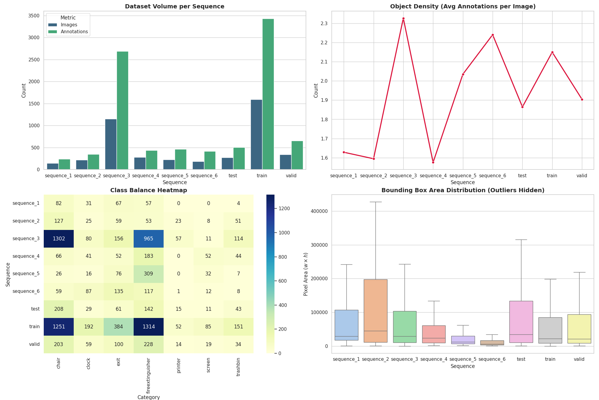
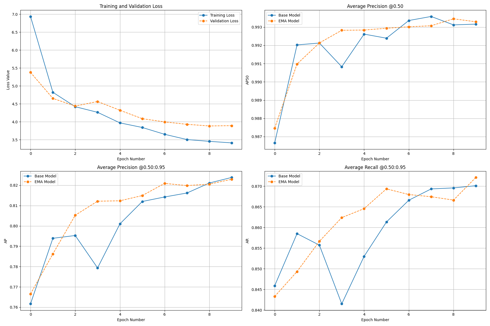
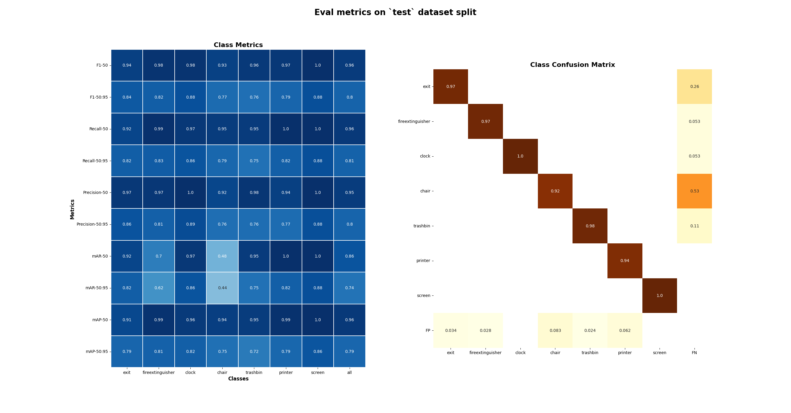

# RF-DETR & Indoor Object Detection Dataset 

Fine-tuning [RF-DETR](https://github.com/roboflow/rf-detr) on the [Indoor Object Detection](https://zenodo.org/record/2654485#.YaYShVPMJhE) dataset. 

## Requirements

You need a PyTorch 2.7+ environment with CUDA support

Ensure you have the following Python libraries installed:

```bash
pip install -r ./requirements.txt
```

## Prepare Dataset

### 1. Download & unpack `Indoor Object Detection Dataset.zip` and make following dirs structure:

```shell
    dataset/
    ├── annotations/
    │   ├── annotation_s1.xml
    │   ├── annotation_s2.xml
    │   └── ...
    ├── sequence_1/
    │   ├── frame_s1_1.jpg
    │   ├── frame_s1_2.jpg
    │   ├── frame_s1_3.jpg
    │   └── ...
    ├── sequence_2/
    │   ├── frame_s2_1.jpg
    │   ├── frame_s2_2.jpg
    │   ├── frame_s2_3.jpg
    │   └── ...
    └── ...
```

### 2. To train RF-DETR, convert Indoor Object Detection dataset to COCO format:

```Bash
python prepare_coco.py --data-path './dataset/'
```

### 3. To view dataset statistics:

```Bash
python stat_coco.py --data-path './dataset/'
```

You will see following metrics:

- Dataset Volume per Sequence
- Object Density (Avg Annotations per Image)
- Class Balance Heatmap
- Bounding Box Area Distribution (Outliers Hidden)

### 4. Split 6 dataset sequences to Train, Valid, Test:

```Bash
python split_coco.py --data-path './dataset/'
```

Default split strategy is:

```shell
STRATEGY = {
    "sequence_1": {'splits': {'train': 0.8, 'valid': 0.2}, 'max_seq' : 5}, # sequence_1 for Train & Valid
    "sequence_2": {'splits': {'test': 0.6, 'valid': 0.4}, 'max_seq' : 5}, # sequence_2 only for Test & Valid
    "sequence_3": {'splits': {'train': 0.8, 'test': 0.1, 'valid': 0.1}, 'max_seq' : 40}, # sequence_3 for Train, Valid & Test, to fix class bias
    "sequence_4": {'splits': {'train': 0.8, 'test': 0.1, 'valid': 0.1}, 'max_seq' : 10}, # sequence_4 for Train, Valid & Test, to fix class bias
    "sequence_5": {'splits': {'train': 0.8, 'valid': 0.2}, 'max_seq' : 5}, # sequence_5 only for Train & Valid
    "sequence_6": {'splits': {'train': 0.8, 'valid': 0.2}, 'max_seq' : 5}, # sequence_6 only for Train & Valid
}
```
`splits` means we chop it up by `max_seq` batches by ratio of train, valid or test splits.

*(`train`, `valid`, `test` are required split names for `roboflow-coco` dataset format)*

### 5. View final dataset statistics with `train`, `valid`, `test` splits:

```Bash
python split_coco.py --data-path './dataset/'
```




### [Oprional] View dataset images and labels by [fiftyone](https://github.com/voxel51/fiftyone):

Install:
```Bash
pip install fiftyone
```

Run:

```Bash
python vis_dataset.py --data-dir './dataset/' --split 'test'
```

## Fine-tuning RF-DETR medium model

### 1. Run train script:

```Bash
python train.py --epochs 10 \
                --batch-size 12 \
                --lr 1.5e-4 \
                --output-dir './output/epoch-10'
```

### Resalts:

| Method    | mAP-50 | mAP-50:95 | F1-50 | F1-50:95 | Epoches | Resolution | LR     | Num Clasess | Params (M) |                                                                                          Model |
|-----------|--------|-----------|-------|----------|---------|------------|--------|-------------|------------|-----------------------------------------------------------------------------------------------:| 
| RF-DETR-M | 0.96   | 0.79      | 0.96  | 0.8      | 10      | 576x576    | 1.5e-4 | 7           | 33.7       |  [Weights](https://drive.google.com/drive/folders/19k2Oyycck7i5WalqPlSY38ACyHp_69z4?usp=sharing) |


### Train metrics on `valid` split:




### 2. Eval model on `test` split:

```Bash
python eval.py --weights './output/epoch-10/checkpoint_best_total.pth' \
               --data-dir './dataset/' \
               --split 'test' \
               --confidence 0.4
```




### 3. Run inference with dataset gt labels:

```Bash
python infer.py --weights './output/epoch-10/checkpoint_best_total.pth' \
                --data-dir './dataset/' \
                --split 'test' \
                --confidence 0.4 \
                --save-imgs true \
                --save-dir './output/test-10'
```
*(If `--save-imgs` is `false`, it will show each frame iteratively)*

### *[Download](https://drive.google.com/file/d/1WSZ47Xc9SXd5Hghp2-S0-vd5i20Wgwlo/view?usp=sharing) all test dataset images with predicted labels.*

## Some good & bad predictions:

### [Examples.md](./Examples.md)